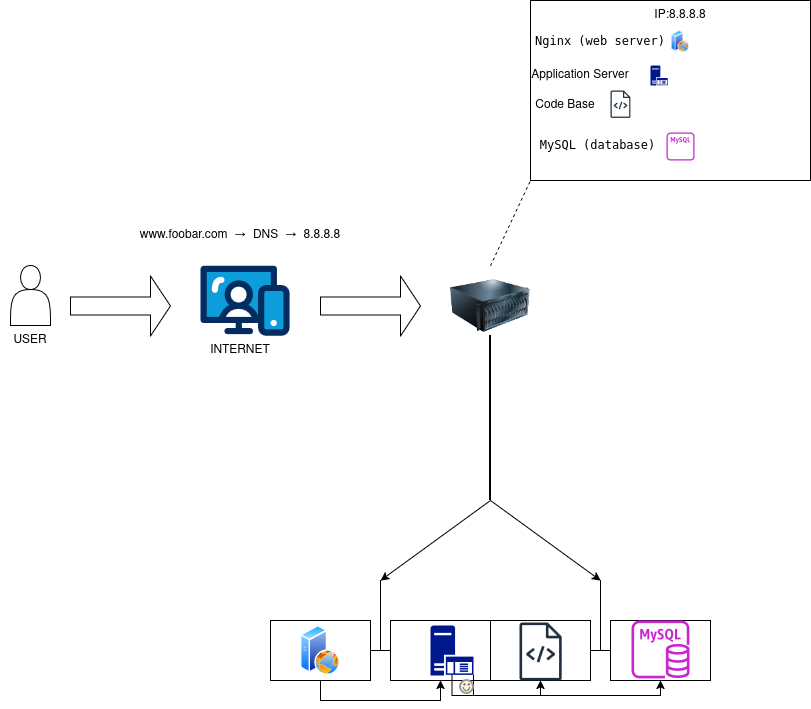

    Serveur : ordinateur, machine virtuelle, ou ensemble d’appareil physique qui héberge tout type d’application ou de service (SaaS, DBaaS, etc.).

    Nom de domaine : une adresse IP traduite en adresse lisible à l’œil humain via le protocole DNS.

    Enregistrement DNS : Domain Name System, s’occupe de traduire une URL web en adresse IP, dispose de plusieurs enregistrements notamment de type A qui dit www.foobar.com = IP 8.8.8.8.

    Serveur Web (Nginx) : c’est un serveur qui s’occupe du stockage des éléments d’un site web et de leur affichage, il gère aussi requête utilisateur et requête du serveur d’application.

    Serveur d’application : il exécute le code (ex: PHP, Python) pour générer la page dynamique.

    Base de données (MySQL) : elle stocke les données (utilisateurs, articles, etc.) et les envoie au serveur d’application.

    Protocole de communication : HTTP/HTTPS (sur le port 80 ou 443) via TCP/IP en base.

    SPOF : point unique d’un système informatique, un seul serveur par exemple dont le système est dépendant et dont une panne entraîne l’arrêt total du système, il a comme caractéristique de ne pas être protégé.

    Downtime lors maintenance : pour redémarrer Nginx ou déployer du nouveau code, il faut couper le serveur → les utilisateurs ne peuvent plus accéder au site temporairement.

    Impossible de scaler : Verdun 1916, mais informatique sans load balancer c’est fini.