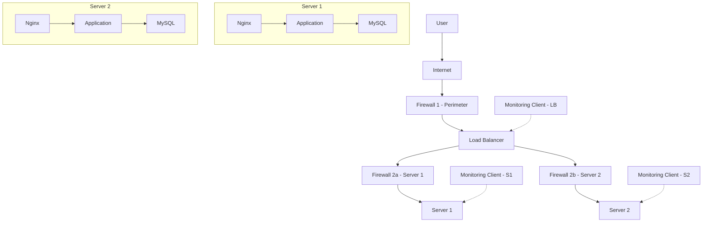

Overview
--------
This design hosts www.foobar.com across a three-server architecture with security and monitoring in mind. Key additions required by the task are included: three firewalls, one SSL certificate for www.foobar.com, and three monitoring clients.

What I added and why
--------------------
- Three firewalls:
    - `Firewall 1` (perimeter): filters incoming traffic from the Internet, blocks unwanted ports and IP ranges before reaching the load balancer.
    - `Firewall 2a` and `Firewall 2b` (server-level): isolate each backend server, restrict access to management ports, and limit lateral movement if a host is compromised.
- One SSL certificate for `www.foobar.com`:
    - Installed at the entry point (LB) to serve HTTPS to users and prove domain ownership.
- Three monitoring clients:
    - One agent on the load balancer and one on each backend server (LB, S1, S2). These agents collect metrics and logs and forward them to a central monitoring/observability service (Sumo Logic, Datadog, Prometheus + remote storage, etc.).

Why firewalls
-------------
Firewalls enforce network boundaries and policy. They:
- Block unwanted external traffic (e.g., unused TCP/UDP ports).
- Enforce access control (limit which IPs or networks can reach which services).
- Reduce attack surface and slow or stop automated attacks and scanners.

Why serve traffic over HTTPS (TLS)
---------------------------------
- Encrypts data in transit, protecting credentials, cookies and personal data from eavesdropping.
- Provides integrity (detects tampering) and authentication (clients verify the server identity via its certificate).
- Required by modern browsers and best practice for SEO and user trust.

Monitoring design and how data is collected
-----------------------------------------
- Monitoring agents (clients) run on each host and perform the following tasks:
    - Collect system metrics: CPU, memory, disk, network usage.
    - Collect service metrics: Nginx request counts, response codes, latency; MySQL metrics (connections, queries per second, replication status).
    - Tail logs: Nginx access/error logs, application logs, system logs.
    - Export traces or application metrics (if instrumented) to the observability backend.
- Transport: agents push data periodically to a central collector over TLS (HTTPS) or send to a local push gateway; some agents can also use UDP or a pull model.
- The central service aggregates, stores, indexes and visualizes metrics and logs, and raises alerts based on defined rules.

How to monitor web server QPS (Queries Per Second)
-------------------------------------------------
1. Enable Nginx access logs or the Nginx stub_status / status module.
2. Configure the monitoring agent to parse access logs or scrape the status endpoint.
3. Compute QPS as the count of requests over a sliding 1s/10s window and send that metric to the central system.
4. Create alerts (for example: alert if QPS > 1000 sustained for 5 minutes, or if QPS drops unexpectedly indicating an outage).

Issues and trade-offs (explain each requested problem)
-----------------------------------------------------
1) Terminating SSL at the load balancer
    - Issue: If TLS is terminated at the LB, traffic between the LB and backend servers is plaintext unless TLS is re-established to the backends. This increases risk because anyone with access to the internal network could intercept or tamper with requests.
    - Mitigation: Use end-to-end TLS (re-encrypt between LB and backends), use mutual TLS for backend connections, or run TLS passthrough if necessary. Use strong cipher suites and keep certificates rotated.

2) Having only one MySQL server capable of accepting writes
    - Issue: A single writable primary is a single point of failure for writes. If it fails, the application cannot persist new data (creates downtime and possible data loss if writes were cached locally).
    - Mitigation: Implement automated failover (e.g., MHA, Orchestrator), use asynchronous replication with promoted replicas, or use a clustered DB solution (Galera, multi-master) or managed DB with automatic failover.

3) Servers containing all components (web, app and database) on each host
    - Issue: Collocating web, application and database on the same machines reduces isolation and scalability. A noisy neighbor (e.g., a high CPU web process) can affect DB performance. It also complicates backups, scaling and security boundaries.
    - Mitigation: Separate concerns: have dedicated tiers (load balancer, web/app nodes, database nodes). Use autoscaling for stateless layers and keep stateful components on specialized nodes.

Summary and next steps
----------------------
- The document now contains an English description that meets the task: three firewalls, one SSL certificate for `www.foobar.com`, three monitoring clients, explanations for each required question, and a list of issues and mitigations.
- Next steps I can take on request: export the Mermaid diagram to PNG, generate a PDF report, or add concrete configuration snippets for HAProxy, Nginx logging, or a monitoring agent (Prometheus node_exporter / Telegraf / Sumo Logic collector).

End