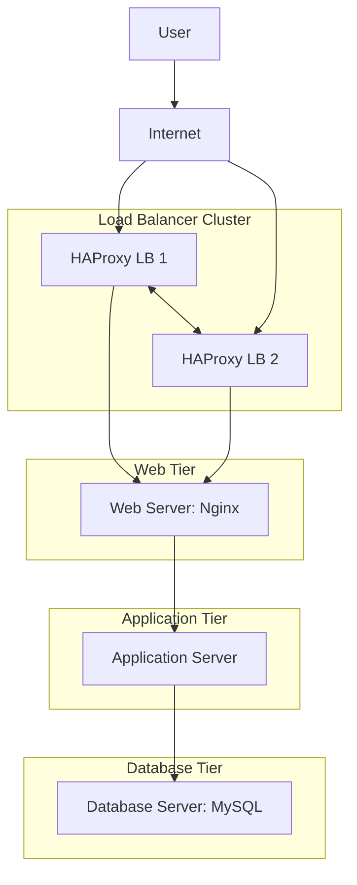

Scale up overview
------------------
- Two load balancers are used as a cluster so the entry point is highly available.
- One web server handles HTTP requests and static content.
- One application server runs the application logic.
- One database server stores the data separately from the application layer.
